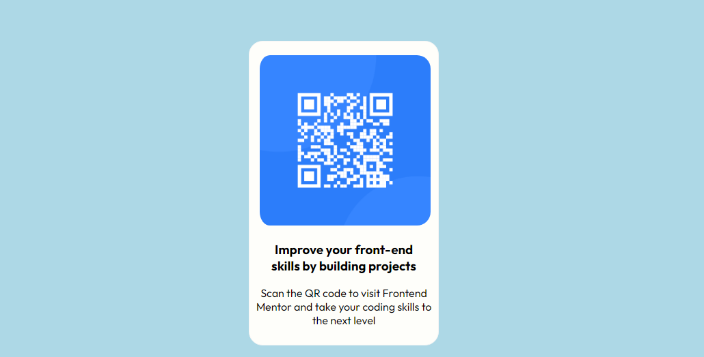

# Frontend Mentor - QR code component solution

This is a solution to the [QR code component challenge on Frontend Mentor](https://www.frontendmentor.io/challenges/qr-code-component-iux_sIO_H). Frontend Mentor challenges help you improve your coding skills by building realistic projects. 

## Table of contents

- [Frontend Mentor - QR code component solution](#frontend-mentor---qr-code-component-solution)
  - [Table of contents](#table-of-contents)
  - [Overview](#overview)
    - [Screenshot](#screenshot)
    - [Links](#links)
  - [My process](#my-process)
    - [Built with](#built-with)
    - [What I learned](#what-i-learned)
    - [Useful resources](#useful-resources)
  - [Author](#author)

## Overview
A qr-code-component project from frontendmentor.io 
### Screenshot

Screenshot of qr-code-component application.

### Links

- Solution URL: [Add solution URL here](https://your-solution-url.com)
- Live Site URL: [Add live site URL here](https://your-live-site-url.com)

## My process
I started with html, working on the components, then designed it with css to give it that design according
to frontendmentor design classification. 

### Built with
- Semantic HTML5 markup
- CSS custom properties
- Mobile-first workflow

### What I learned

My css was actually quite improved in the process, especially with text-alignment.

### Useful resources

- [Resource 1](https://www.w3schools.com/css/css_text_align.asp) - This helped me with my css text-alignment pruose.
- [Resource 2](https://www.w3schools.com/html/default.asp) - This helped with my html.

## Author

- Website - [James Ibezim](https://www.your-site.com)
- Frontend Mentor - [@Jimztech](https://www.frontendmentor.io/profile/Jimztech)
- Twitter - [engr_jamie](https://www.x.com/engr_jamie)

